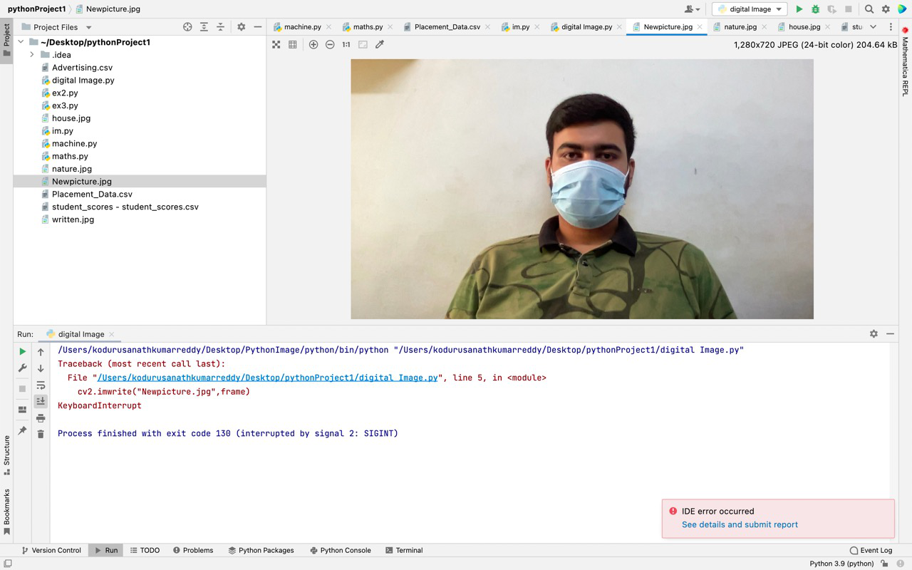
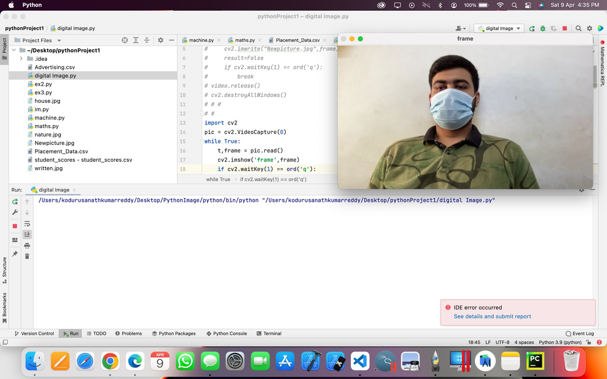
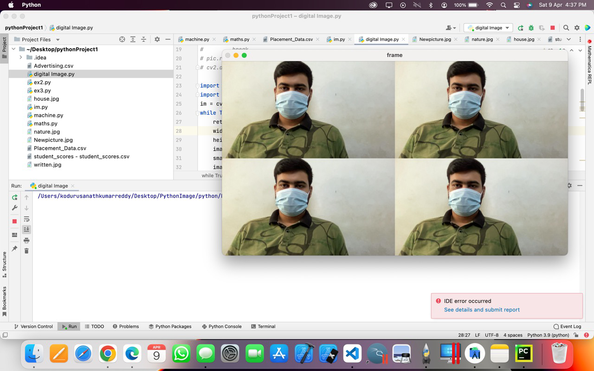
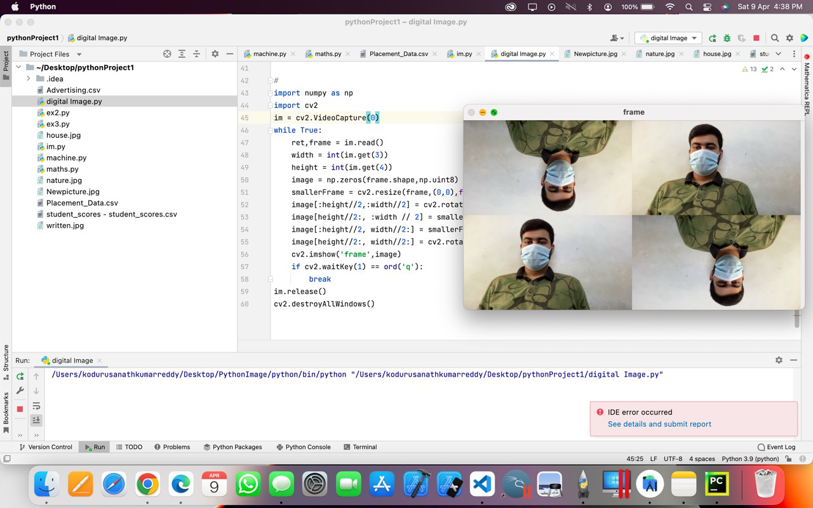

# Image-Acquisition-from-Web-Camera
## Aim
 
Aim:
 
To write a python program using OpenCV to capture the image from the web camera and do the following image manipulations.
i) Write the frame as JPG 
ii) Display the video 
iii) Display the video by resizing the window
iv) Rotate and display the video

## Software Used
Anaconda - Python 3.7
## Algorithm
### Step 1:

Import Opencv Package.


### Step 2:

Capture the Video from the WebCamera.


### Step 3:

Write the image to a file.


### Step 4:

Show the image or the live camera.


### Step 5:

End the program.


## Program:
``` Python
### Developed By:SOUVIK KUNDU
### Register No:212221230105

## i) Write the frame as JPG file

import cv2
video = cv2.VideoCapture(0)
while(True):
    t,frame = video.read()
    cv2.imwrite("Newpicture.jpg",frame)
    result=False
    if cv2.waitKey(1) == ord('b'):
        break
video.release()
cv2.destroyAllWindows()


## ii) Display the video

import cv2
pic = cv2.VideoCapture(0)
while True:
    t,frame = pic.read()
    cv2.imshow('frame',frame)
    if cv2.waitKey(1) == ord('b'):      
        break
pic.release()
cv2.destroyAllWindows()


## iii) Display the video by resizing the window

import numpy as np
import cv2
im = cv2.VideoCapture(0)
while True:
    ret,frame = im.read()
    width = int(im.get(3))
    height = int(im.get(4))
    image = np.zeros(frame.shape,np.uint8)
    smallerFrame = cv2.resize(frame,(0,0),fx = 0.5,fy=0.5)
    image[:height//2,:width//2] = smallerFrame
    image[height//2:, :width // 2] = smallerFrame
    image[:height//2, width//2:] = smallerFrame
    image[height//2:, width//2:] = smallerFrame
    cv2.imshow('frame',image)
    if cv2.waitKey(1) == ord('b'):
        break
im.release()
cv2.destroyAllWindows()


## iv) Rotate and display the video

import numpy as np
import cv2
im = cv2.VideoCapture(0)
while True:
    ret,frame = im.read()
    width = int(im.get(3))
    height = int(im.get(4))
    image = np.zeros(frame.shape,np.uint8)
    smallerFrame = cv2.resize(frame,(0,0),fx = 0.5,fy=0.5)
    image[:height//2,:width//2] = cv2.rotate(smallerFrame,cv2.ROTATE_180)
    image[height//2:, :width // 2] = smallerFrame
    image[:height//2, width//2:] = smallerFrame
    image[height//2:, width//2:] = cv2.rotate(smallerFrame,cv2.ROTATE_180)
    cv2.imshow('frame',image)
    if cv2.waitKey(1) == ord('b'):
        break
im.release()
cv2.destroyAllWindows()


```
## Output

### i) Write the frame as JPG image
</br>



</br>


### ii) Display the video
</br>



</br>


### iii) Display the video by resizing the window
</br>



</br>


### iv) Rotate and display the video
</br>



</br>


## Result:
Thus the image is accessed from webcamera and displayed using openCV.
